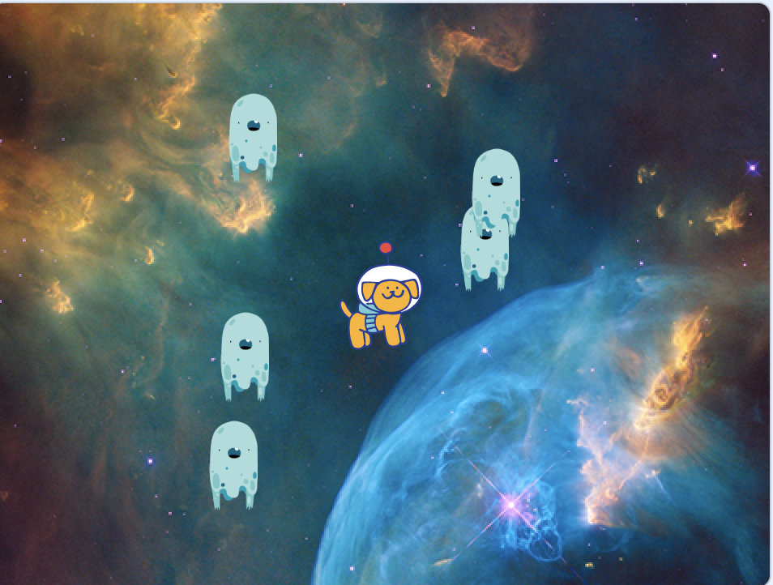
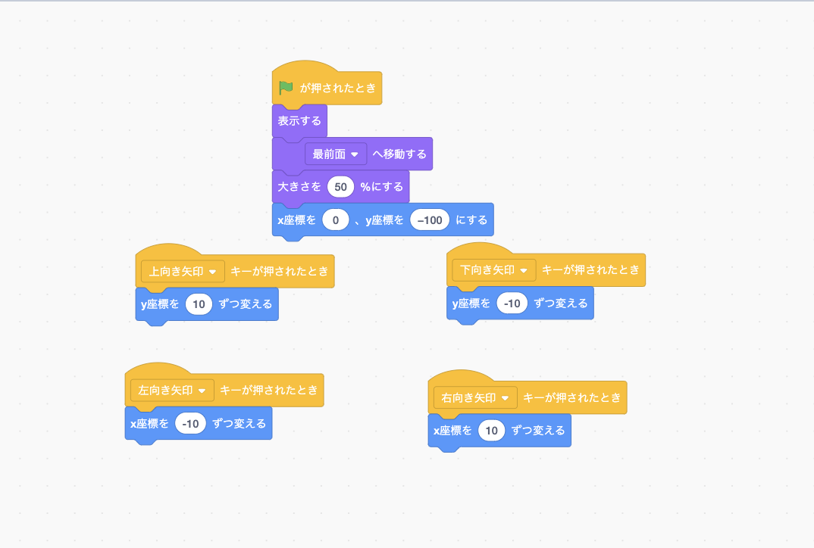
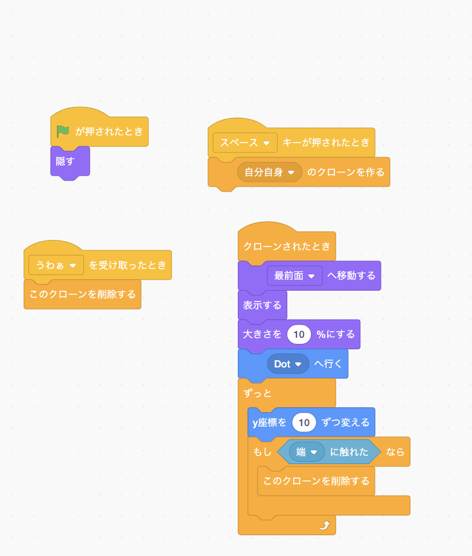
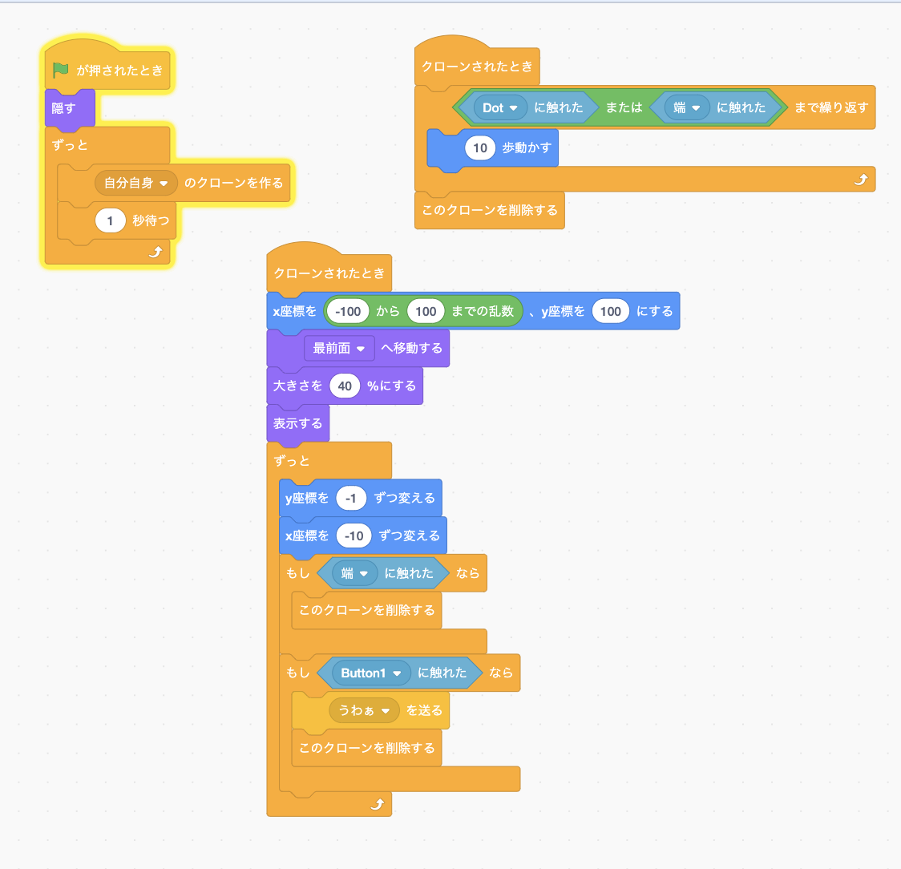

# スクラッチのゲーム

## 完成図

## 完成したコード

## ゲームの作り方

- [犬のストライプ配置](01.md)
- [犬のプログラムの作成](02.md)
- [背景の変更](03.md)
- [宇宙人のストライプの配置](04.md)
- [宇宙人のプログラムの作成](05.md)
- [ボールのストライプの配置](06.md)
- [ボールのプログラムの作成](07.md)
